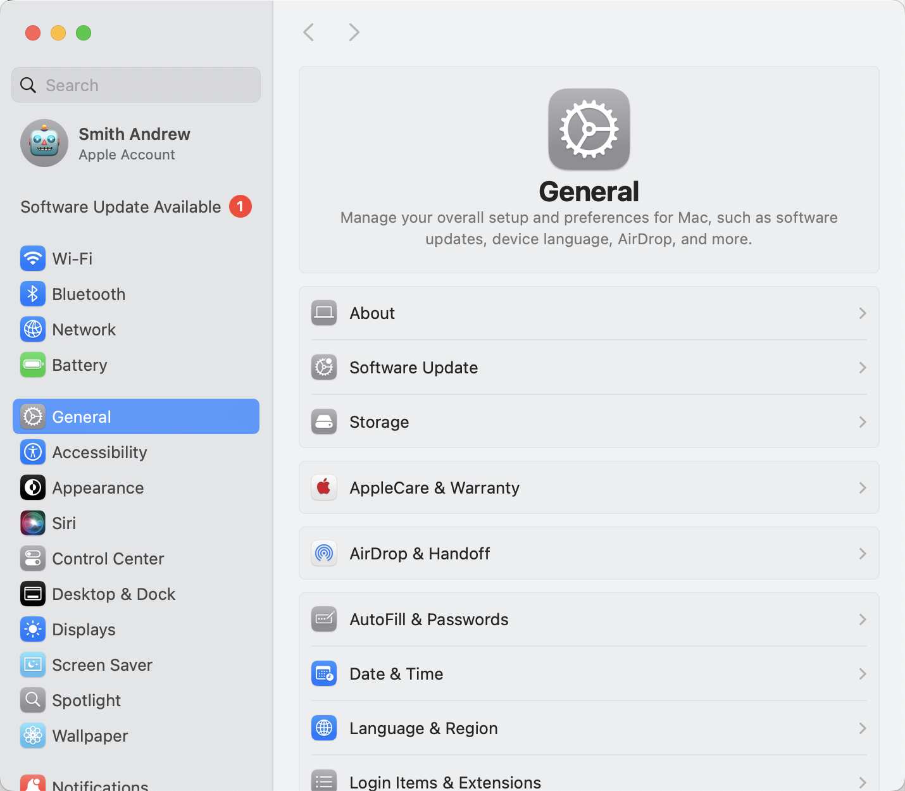
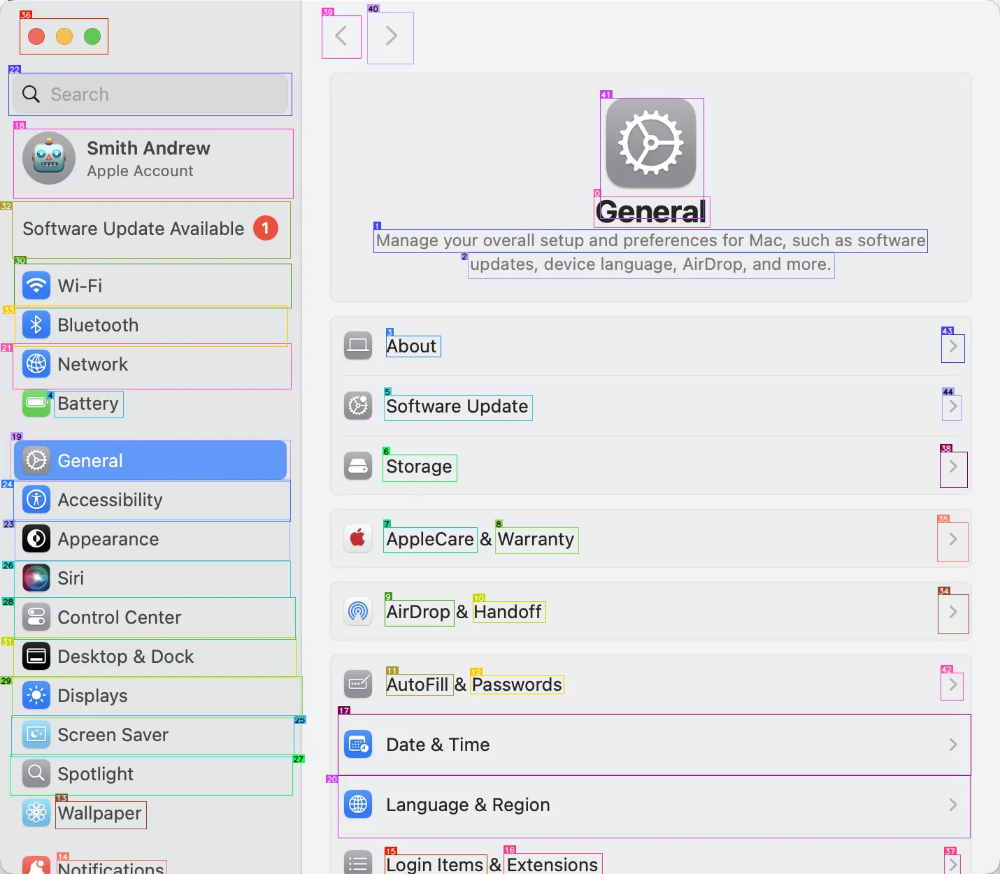

# Use OmniParser with CPU (Macos M1 Pro)

## Device information

```
MacBook Air M1, 2020
Chip: Apple M1
Cores: 8 (4 performance and 4 efficiency)
Memory: 8GB
```

## process time

```
0: 1120x1280 36 icons, 1469.6ms
Speed: 77.1ms preprocess, 1469.6ms inference, 20.9ms postprocess per image at shape (1, 3, 1120, 1280)
len(filtered_boxes): 45 34
time to get parsed content: 116.20102977752686
finish processing
```

## parsed content

Input image:



Output image:


```
icon 0: {'type': 'text', 'bbox': [0.5937063097953796, 0.2248000055551529, 0.7097902297973633, 0.25999999046325684], 'interactivity': False, 'content': 'General', 'source': 'box_ocr_content_ocr'}
icon 1: {'type': 'text', 'bbox': [0.3734265863895416, 0.2624000012874603, 0.9272727370262146, 0.2888000011444092], 'interactivity': False, 'content': 'Manage your overall setup and preferences for Mac, such as software', 'source': 'box_ocr_content_ocr'}
icon 2: {'type': 'text', 'bbox': [0.46783217787742615, 0.2879999876022339, 0.8342657089233398, 0.31839999556541443], 'interactivity': False, 'content': 'updates, device language, AirDrop, and more.', 'source': 'box_ocr_content_ocr'}
icon 3: {'type': 'text', 'bbox': [0.3860139846801758, 0.3840000033378601, 0.440559446811676, 0.40799999237060547], 'interactivity': False, 'content': 'About', 'source': 'box_ocr_content_ocr'}
icon 4: {'type': 'text', 'bbox': [0.05384615436196327, 0.4472000002861023, 0.1230769231915474, 0.47760000824928284], 'interactivity': False, 'content': 'Battery', 'source': 'box_ocr_content_ocr'}
icon 5: {'type': 'text', 'bbox': [0.38391607999801636, 0.4519999921321869, 0.5321678519248962, 0.48080000281333923], 'interactivity': False, 'content': 'Software Update', 'source': 'box_ocr_content_ocr'}
icon 6: {'type': 'text', 'bbox': [0.3825174868106842, 0.5199999809265137, 0.45664334297180176, 0.5504000186920166], 'interactivity': False, 'content': 'Storage', 'source': 'box_ocr_content_ocr'}
icon 7: {'type': 'text', 'bbox': [0.3832167685031891, 0.6032000184059143, 0.4769230782985687, 0.6320000290870667], 'interactivity': False, 'content': 'AppleCare', 'source': 'box_ocr_content_ocr'}
icon 8: {'type': 'text', 'bbox': [0.49510490894317627, 0.6032000184059143, 0.5783216953277588, 0.6327999830245972], 'interactivity': False, 'content': 'Warranty', 'source': 'box_ocr_content_ocr'}
icon 9: {'type': 'text', 'bbox': [0.38461539149284363, 0.6863999962806702, 0.45384615659713745, 0.7160000205039978], 'interactivity': False, 'content': 'AirDrop', 'source': 'box_ocr_content_ocr'}
icon 10: {'type': 'text', 'bbox': [0.4727272689342499, 0.6880000233650208, 0.5454545617103577, 0.7120000123977661], 'interactivity': False, 'content': 'Handoff', 'source': 'box_ocr_content_ocr'}
icon 11: {'type': 'text', 'bbox': [0.3860139846801758, 0.7712000012397766, 0.4531468451023102, 0.795199990272522], 'interactivity': False, 'content': 'AutoFill', 'source': 'box_ocr_content_ocr'}
icon 12: {'type': 'text', 'bbox': [0.46993008255958557, 0.7728000283241272, 0.5636363625526428, 0.7936000227928162], 'interactivity': False, 'content': 'Passwords', 'source': 'box_ocr_content_ocr'}
icon 13: {'type': 'text', 'bbox': [0.0559440553188324, 0.9168000221252441, 0.14615385234355927, 0.9480000138282776], 'interactivity': False, 'content': 'Wallpaper', 'source': 'box_ocr_content_ocr'}
icon 14: {'type': 'text', 'bbox': [0.05734265595674515, 0.984000027179718, 0.16643357276916504, 1.0], 'interactivity': False, 'content': 'Notifications', 'source': 'box_ocr_content_ocr'}
icon 15: {'type': 'text', 'bbox': [0.38461539149284363, 0.9775999784469604, 0.4867132902145386, 1.0], 'interactivity': False, 'content': 'Login Items', 'source': 'box_ocr_content_ocr'}
icon 16: {'type': 'text', 'bbox': [0.503496527671814, 0.9760000109672546, 0.6020979285240173, 1.0], 'interactivity': False, 'content': 'Extensions', 'source': 'box_ocr_content_ocr'}
icon 17: {'type': 'icon', 'bbox': [0.3379982113838196, 0.8169740438461304, 0.9708297252655029, 0.8879255652427673], 'interactivity': True, 'content': 'Date Time ', 'source': 'box_yolo_content_ocr'}
icon 18: {'type': 'icon', 'bbox': [0.013327931985259056, 0.1473410576581955, 0.2935101389884949, 0.22646968066692352], 'interactivity': True, 'content': 'Smith Andrew Apple Account ', 'source': 'box_yolo_content_ocr'}
icon 19: {'type': 'icon', 'bbox': [0.010655664838850498, 0.5033138394355774, 0.29088273644447327, 0.5510449409484863], 'interactivity': True, 'content': 'General ', 'source': 'box_yolo_content_ocr'}
icon 20: {'type': 'icon', 'bbox': [0.33785420656204224, 0.8870705962181091, 0.9701263308525085, 0.958997368812561], 'interactivity': True, 'content': 'Language Region ', 'source': 'box_yolo_content_ocr'}
icon 21: {'type': 'icon', 'bbox': [0.013128900900483131, 0.393402099609375, 0.29098206758499146, 0.4452357888221741], 'interactivity': True, 'content': 'Network ', 'source': 'box_yolo_content_ocr'}
icon 22: {'type': 'icon', 'bbox': [0.008466982282698154, 0.083529993891716, 0.29229453206062317, 0.13230955600738525], 'interactivity': True, 'content': 'Search ', 'source': 'box_yolo_content_ocr'}
icon 23: {'type': 'icon', 'bbox': [0.015113282017409801, 0.594735324382782, 0.28974077105522156, 0.6415660977363586], 'interactivity': True, 'content': 'Appearance ', 'source': 'box_yolo_content_ocr'}
icon 24: {'type': 'icon', 'bbox': [0.01348040159791708, 0.5491158962249756, 0.29070162773132324, 0.5964929461479187], 'interactivity': True, 'content': 'Accessibility ', 'source': 'box_yolo_content_ocr'}
icon 25: {'type': 'icon', 'bbox': [0.011871480382978916, 0.8191115856170654, 0.2938288748264313, 0.8656860589981079], 'interactivity': True, 'content': 'Screen Saver ', 'source': 'box_yolo_content_ocr'}
icon 26: {'type': 'icon', 'bbox': [0.014304542914032936, 0.6419149041175842, 0.2902570962905884, 0.6832561492919922], 'interactivity': True, 'content': 'Siri ', 'source': 'box_yolo_content_ocr'}
icon 27: {'type': 'icon', 'bbox': [0.010425425134599209, 0.8639165163040161, 0.2926750183105469, 0.9097901582717896], 'interactivity': True, 'content': 'Spotlight ', 'source': 'box_yolo_content_ocr'}
icon 28: {'type': 'icon', 'bbox': [0.014205479063093662, 0.6835522651672363, 0.2956092953681946, 0.7315042614936829], 'interactivity': True, 'content': 'Control Center ', 'source': 'box_yolo_content_ocr'}
icon 29: {'type': 'icon', 'bbox': [0.012126971036195755, 0.7736019492149353, 0.3025607764720917, 0.8211022615432739], 'interactivity': True, 'content': 'Displays ', 'source': 'box_yolo_content_ocr'}
icon 30: {'type': 'icon', 'bbox': [0.014442943967878819, 0.30172494053840637, 0.29140737652778625, 0.3521883487701416], 'interactivity': True, 'content': 'Wi-Fi ', 'source': 'box_yolo_content_ocr'}
icon 31: {'type': 'icon', 'bbox': [0.013626241125166416, 0.7288205027580261, 0.2961277365684509, 0.7759291529655457], 'interactivity': True, 'content': 'Desktop Dock ', 'source': 'box_yolo_content_ocr'}
icon 32: {'type': 'icon', 'bbox': [0.012344908900558949, 0.23056650161743164, 0.29080474376678467, 0.29560452699661255], 'interactivity': True, 'content': 'Software Update Available ', 'source': 'box_yolo_content_ocr'}
icon 33: {'type': 'icon', 'bbox': [0.015270520001649857, 0.34967222809791565, 0.2875750660896301, 0.3961273729801178], 'interactivity': True, 'content': 'Bluetooth ', 'source': 'box_yolo_content_ocr'}
icon 34: {'type': 'icon', 'bbox': [0.9379727244377136, 0.680061936378479, 0.9688736796379089, 0.7250880599021912], 'interactivity': True, 'content': 'a push pin or pinning function.', 'source': 'box_yolo_content_yolo'}
icon 35: {'type': 'icon', 'bbox': [0.9375091195106506, 0.5979321002960205, 0.9684471487998962, 0.6426206827163696], 'interactivity': True, 'content': 'a push pin or pinning function.', 'source': 'box_yolo_content_yolo'}
icon 36: {'type': 'icon', 'bbox': [0.01998285949230194, 0.021246029064059258, 0.1083746924996376, 0.061952702701091766], 'interactivity': True, 'content': 'a leaf or leaf, possibly indicating a date, date, or date.', 'source': 'box_yolo_content_yolo'}
icon 37: {'type': 'icon', 'bbox': [0.9443888068199158, 0.9783767461776733, 0.960723340511322, 1.0], 'interactivity': True, 'content': 'a single line or pinning function.', 'source': 'box_yolo_content_yolo'}
icon 38: {'type': 'icon', 'bbox': [0.9400246143341064, 0.5173144340515137, 0.9677855372428894, 0.5576093196868896], 'interactivity': True, 'content': 'a push pin or pinning function.', 'source': 'box_yolo_content_yolo'}
icon 39: {'type': 'icon', 'bbox': [0.3222188949584961, 0.017892371863126755, 0.36126577854156494, 0.06713973730802536], 'interactivity': True, 'content': 'a push pin or move back.', 'source': 'box_yolo_content_yolo'}
icon 40: {'type': 'icon', 'bbox': [0.3673999309539795, 0.013960001990199089, 0.4134761393070221, 0.07283931970596313], 'interactivity': True, 'content': 'a push pin or move action.', 'source': 'box_yolo_content_yolo'}
icon 41: {'type': 'icon', 'bbox': [0.6001870036125183, 0.11269345879554749, 0.7039801478385925, 0.24972189962863922], 'interactivity': True, 'content': 'A logo or logo related to something related.', 'source': 'box_yolo_content_yolo'}
icon 42: {'type': 'icon', 'bbox': [0.9408974647521973, 0.7698627710342407, 0.9631999135017395, 0.8009019494056702], 'interactivity': True, 'content': 'a push pin or pinning function.', 'source': 'box_yolo_content_yolo'}
icon 43: {'type': 'icon', 'bbox': [0.9413397312164307, 0.3824390769004822, 0.964432954788208, 0.41496703028678894], 'interactivity': True, 'content': 'a push pin or pinning function.', 'source': 'box_yolo_content_yolo'}
icon 44: {'type': 'icon', 'bbox': [0.9421424865722656, 0.452243834733963, 0.9608699679374695, 0.48083335161209106], 'interactivity': True, 'content': 'a single pin or pinning function.', 'source': 'box_yolo_content_yolo'}

```
